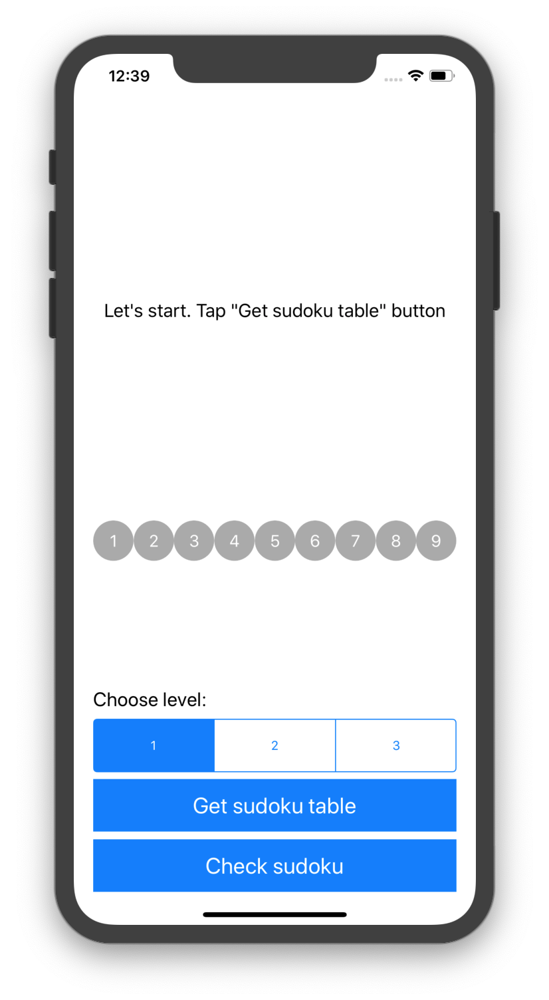
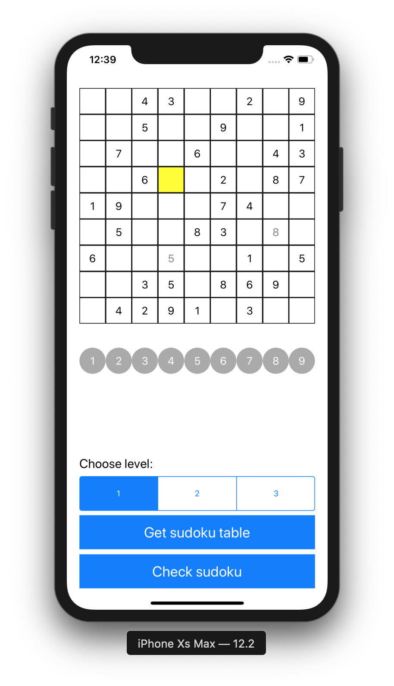
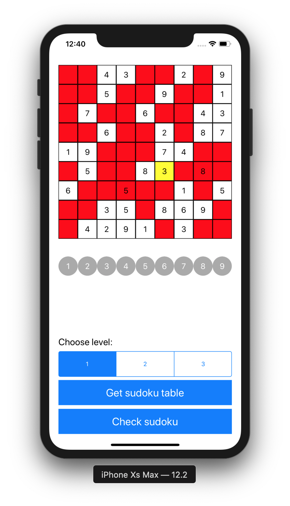

# Sudoku game
### Тема
Разработать игру судоку. Данные для игры берутся из БД (варианты игры не менее 10). Уровень сложности задается перед началом игры. Информация должна предоставляться в графическом виде. Также должна осуществляться проверка игры.
### Скриншоты

### База данных
Одна сущность - судоку. Имеет четыре поля (id, level, values, rightValues)
Сервер на localhost'e
phpMyAdmin (http://macnotes.ru/post/phpmyadmin-macos)

